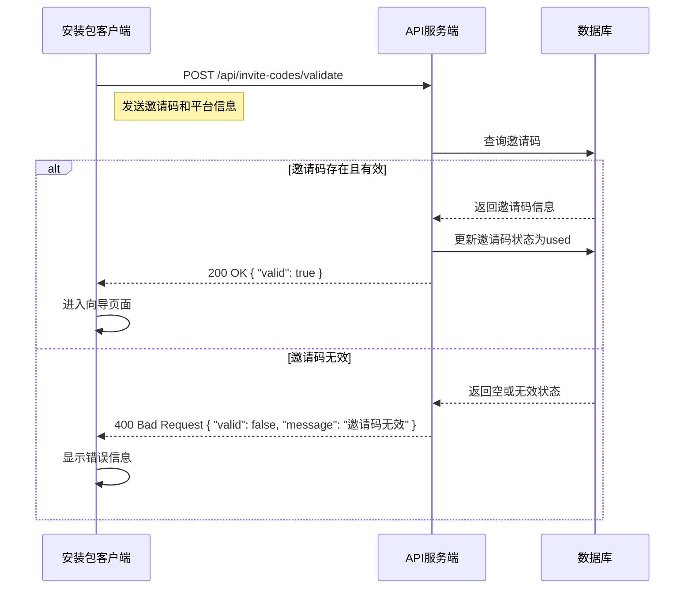
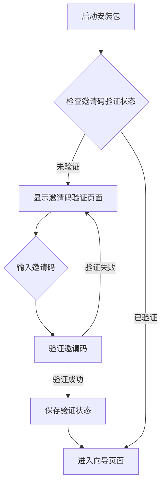

# 代理后台与邀请码系统设计方案

## 1. 整体架构

### 1.1 系统架构

本方案设计了一个独立部署的代理后台系统，用于管理邀请码的创建和分发，同时在安装包中集成邀请码验证功能。整体架构如下：

```
┌─────────────────┐       ┌─────────────────┐       ┌─────────────────┐
│  代理后台系统   │       │  API服务端      │       │  安装包客户端   │
│  (独立部署)     │◄──────┤  (服务器部署)   │◄──────┤  (跨平台)       │
└─────────────────┘       └─────────────────┘       └─────────────────┘
        │                         │                         │
        ▼                         ▼                         ▼
┌─────────────────┐       ┌─────────────────┐       ┌─────────────────┐
│  数据库         │       │  邀请码管理API  │       │  邀请码验证     │
│  (MongoDB)      │       │  (Node.js)      │       │  (Tauri)        │
└─────────────────┘       └─────────────────┘       └─────────────────┘
```

### 1.2 技术栈选择

| 组件 | 技术 | 版本 | 说明 |
|------|------|------|------|
| 代理后台前端 | React 18 + TypeScript + TailwindCSS | 最新 | 与现有项目保持一致的技术栈 |
| 代理后台后端 | Node.js + Express.js | 最新 | 提供API服务 |
| 数据库 | MongoDB | 最新 | 存储用户、邀请码等数据 |
| 安装包客户端 | Tauri + React | 最新 | 跨平台桌面应用 |
| 认证 | JWT | - | 无状态认证 |

## 2. 双角色权限系统

### 2.1 角色定义

| 角色 | 权限 | 功能 |
|------|------|------|
| **管理员** | 完全权限 | 1. 创建和管理管理员账号<br>2. 创建和管理代理账号<br>3. 创建和管理邀请码<br>4. 查看所有统计数据<br>5. 系统配置管理 |
| **代理** | 有限权限 | 1. 创建和分发邀请码<br>2. 禁用邀请码<br>3. 查看自己创建的邀请码统计<br>4. 管理自己的个人信息 |

### 2.2 权限控制实现

- **前端**：基于角色的路由守卫和UI控制
- **后端**：基于JWT的权限验证中间件
- **数据库**：用户表中存储角色信息

## 3. 邀请码系统设计

### 3.1 邀请码生成

1. **生成算法**：
   - 基于时间戳、随机数和加密哈希的组合算法
   - 格式：8-12位字母数字组合，区分大小写
   - 唯一性：使用UUID作为基础，确保全球唯一

2. **生成规则**：
   - 长度：默认为10位
   - 字符集：大写字母(A-Z) + 数字(0-9)
   - 避免混淆字符：如0和O，1和I
   - 支持批量生成

### 3.2 邀请码存储

```javascript
// MongoDB邀请码文档结构
{
  code: "ABC123XYZ",          // 邀请码
  createdBy: "agent123",       // 创建者ID
  createdByName: "代理名称",    // 创建者名称
  createdAt: ISODate("2026-04-11T10:00:00Z"), // 创建时间
  expiresAt: ISODate("2026-12-31T23:59:59Z"),  // 过期时间
  status: "active",            // 状态：active, used, disabled
  usedBy: "user123",           // 使用用户ID
  usedAt: ISODate("2026-04-15T14:30:00Z"),    // 使用时间
  platform: "windows",         // 使用平台
  metadata: {                  // 附加信息
    note: "测试邀请码",
    maxUses: 1                 // 最大使用次数
  }
}
```

### 3.3 邀请码验证流程

1. **客户端验证**：
   - 用户输入邀请码
   - 前端验证格式
   - 调用API验证邀请码有效性

2. **服务端验证**：
   - 检查邀请码是否存在
   - 检查邀请码是否过期
   - 检查邀请码状态是否为active
   - 检查邀请码是否已达到最大使用次数
   - 验证通过后更新邀请码状态为used

## 4. 跨平台邀请码校验逻辑

### 4.1 校验流程



### 4.2 跨平台兼容性

- **Windows**：使用Tauri的HTTP客户端
- **macOS**：使用相同的HTTP客户端实现
- **Linux**：使用相同的HTTP客户端实现
- **网络异常处理**：实现离线验证机制，允许在网络不可用时使用本地缓存的验证结果

## 5. 安装包启动流程

### 5.1 启动流程



### 5.2 验证页面设计

- **界面**：简洁的邀请码输入界面
- **功能**：
  - 邀请码输入框
  - 验证按钮
  - 错误信息显示
  - 帮助信息
- **交互**：
  - 实时验证邀请码格式
  - 提交后显示验证状态
  - 验证成功后自动进入向导

## 6. 代理后台功能设计

### 6.1 核心功能

1. **用户管理**：
   - 管理员账号管理（创建、编辑、禁用）
   - 代理账号管理（创建、编辑、禁用）
   - 密码重置和权限修改

2. **邀请码管理**：
   - 批量生成邀请码
   - 查看邀请码列表和状态
   - 禁用邀请码
   - 导出邀请码

3. **统计分析**：
   - 邀请码使用情况统计
   - 平台分布统计
   - 时间趋势分析
   - 代理业绩统计

4. **系统设置**：
   - API配置
   - 邀请码规则配置
   - 系统日志查看

### 6.2 界面设计

- **仪表盘**：概览统计数据和关键指标
- **用户管理**：用户列表和编辑界面
- **邀请码管理**：邀请码列表和生成界面
- **统计报表**：图表展示统计数据
- **系统设置**：配置项管理界面

## 7. 实施步骤

### 7.1 代理后台实施

1. **环境搭建**：
   - 安装Node.js和MongoDB
   - 创建项目目录结构
   - 安装依赖包

2. **后端开发**：
   - 实现用户认证和授权
   - 实现邀请码管理API
   - 实现统计分析API
   - 实现错误处理和日志记录

3. **前端开发**：
   - 实现登录和注册界面
   - 实现管理员和代理控制台
   - 实现邀请码管理界面
   - 实现统计分析界面

4. **部署**：
   - 配置生产环境
   - 部署到服务器
   - 配置域名和SSL证书
   - 设置定期备份

### 7.2 安装包集成

1. **前端修改**：
   - 创建邀请码验证页面
   - 修改App.tsx路由逻辑
   - 更新状态管理

2. **后端修改**：
   - 添加邀请码验证命令
   - 集成API调用
   - 实现离线验证机制

3. **测试**：
   - 测试邀请码生成和验证
   - 测试跨平台兼容性
   - 测试网络异常处理
   - 测试安全性

4. **发布**：
   - 构建安装包
   - 测试安装流程
   - 发布到用户

## 8. 安全最佳实践

### 8.1 邀请码安全

- **生成安全**：使用密码学安全的随机数生成器
- **传输安全**：使用HTTPS加密传输
- **存储安全**：邀请码哈希存储，防止数据库泄露
- **验证安全**：实现速率限制，防止暴力破解

### 8.2 代理后台安全

- **认证安全**：使用JWT认证，设置合理的过期时间
- **授权安全**：严格的角色权限控制
- **输入验证**：防止SQL注入和XSS攻击
- **日志安全**：记录所有关键操作，便于审计
- **备份安全**：定期备份数据库，防止数据丢失

### 8.3 安装包安全

- **代码签名**：对安装包进行数字签名
- **防篡改**：验证安装包完整性
- **网络安全**：使用HTTPS与API通信
- **本地存储**：安全存储验证状态，防止本地篡改

## 9. 总结

本设计方案通过创建独立的代理后台系统，实现了邀请码的集中管理和分发，同时在安装包中集成了邀请码验证功能，确保只有持有有效邀请码的用户才能使用应用。方案采用了双角色权限系统，分别为管理员和代理提供了不同的权限和功能，满足了不同用户的需求。

通过跨平台邀请码校验逻辑，确保了安装包在不同平台的验证一致性，提高了用户体验。同时，方案还提供了详细的实施步骤和安全最佳实践，确保系统的安全性和可靠性。

此方案不仅满足了当前的需求，还为未来的功能扩展和系统升级预留了空间，具有良好的可扩展性和可维护性。